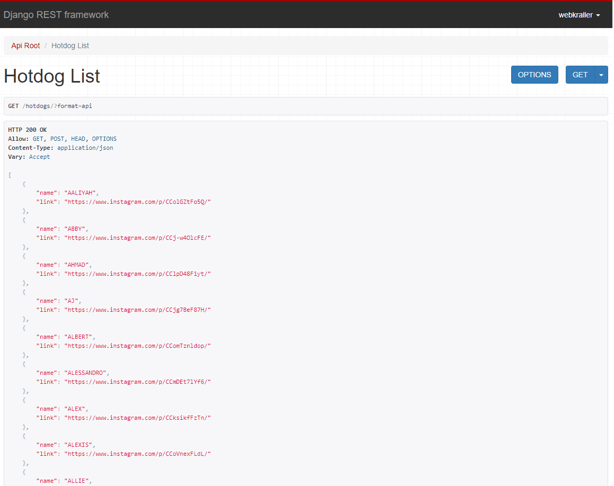

I wanted to brush up on the most recent versions of Django and the [Django Restful Framework](https://www.django-rest-framework.org/).
I had access to the dataset and recency bias of [What Hotdog You Are](/projects/seach-what-hotdog-you-are/).
So I built an API using these things!

Now, countless generations will be able to programmatically connect to determine what hot dog they are.

<a target="_blank" href="https://github.com/webkraller/hotdogsearch-api">Source</a>

